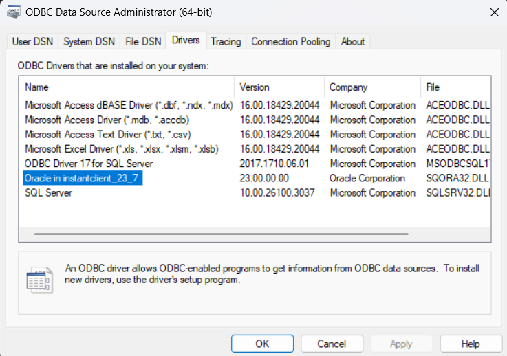
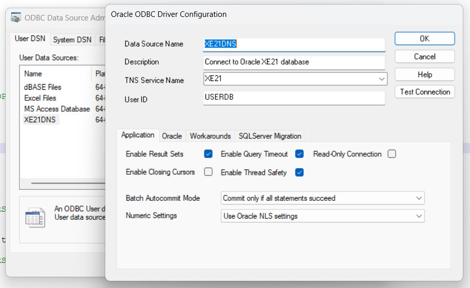

# Reference
* [Oracle Database Development with Docker](https://blogs.oracle.com/coretec/post/oracle-database-with-docker)
* [Creating a Containerized Oracle Database with Docker](https://medium.com/@legionary204/creating-a-containerized-oracle-database-with-docker-b21cd13dd846)

# Creating a Containerized Oracle Database with Docker

Oracle’s Container Registry: The database images that we will use can be found in [Oracle’s Container Registry](http://container-registry.oracle.com/)

Docker Login to Oracle Container Registry:
```
$ docker login container-registry.oracle.com
Username: xxx
Password: xxx
Login Succeeded
```

Pull the Oracle Database Docker image using the command:
```
$ docker pull container-registry.oracle.com/database/express:latest
```

Create a new container using the command:
```
$ docker run --name oracle_db -p 1521:1521 -e ORACLE_PWD=password123 container-registry.oracle.com/database/express:latest
```

Once the below message “DATABASE IS READY TO USE!” shows up, this means that the database is ready for use.

Connecting to the Database: 
* Download Oracle SQL Developer from the link below
* https://www.oracle.com/database/sqldeveloper/technologies/download/

We will input the following information:
* Name: Oracle_Docker (But can be anything)
* Username: sys
* Password: password123 (Whatever was specified in the ORACLE_PWD variable).
* Role: SYSDBA (For first time connection we will use this).
* Hostname: localhost
* Port: 1521
* Service name: XEPDB1 (Choosing Service name will disable SID).

Once all information have been inputted, click “Test” button below to test connection. If status says “Success” then this mean connection is working. Next, simply click “Connect” to save connection.


# SQL Collections

Shows the database name in oracle
```sql
SELECT NAME FROM v$database; 
```

Show all DB users
```
SELECT * FROM DBA_USERS;
SELECT * FROM DBA_USERS where account_status = 'OPEN';
SELECT DISTINCT OWNER FROM ALL_OBJECTS;
```

List all query the tablespaces
```
SELECT TABLESPACE_NAME FROM USER_TABLESPACES;
```

Query the users in all tablespaces:
```
select USERNAME, DEFAULT_TABLESPACE from DBA_USERS;
```

Or within a specific tablespace (using my DEV_DB tablespace as an example):
```
select USERNAME, DEFAULT_TABLESPACE from DBA_USERS where DEFAULT_TABLESPACE = 'DEV_DB';
```

Danh sách người dùng
```
select username from dba_users;
```


# Oracle Database on Docker for Development

Ket noi Terminal vao docker
```
docker exec -it oracle_db bash
$ pwd
/home/oracle
```

Connect using the `username` and `password` below.
```
Database Information

hostname: localhost
internal port: 49161
sid: xe
username: system
password: password123
```

**Connected at SQLPlus**
Type `sqlplus` to open SQLPlus in the terminal.
```
$ sqlplus

SQL*Plus: Release 21.0.0.0.0 - Production on Tue Feb 11 04:13:38 2025
Version 21.3.0.0.0

Copyright (c) 1982, 2021, Oracle.  All rights reserved.

Enter user-name: system
Enter password:
Last Successful login time: Wed Aug 02 2023 18:47:08 +00:00

Connected to:
Oracle Database 21c Express Edition Release 21.0.0.0.0 - Production
Version 21.3.0.0.0
SQL>
```

**Setup tablespace**
Run the following commands to set up the new user and tablespace.
```
CREATE TABLESPACE TSD_USERDB LOGGING DATAFILE 'TSD_USERDB.DBF' SIZE 200M AUTOEXTEND ON NEXT 200M MAXSIZE 400M;

CREATE TABLESPACE TSI_USERDB LOGGING DATAFILE 'TSI_USERDB.DBF' SIZE 200M AUTOEXTEND ON NEXT 50M MAXSIZE 400M;

CREATE USER USERDB IDENTIFIED BY PASSWORD DEFAULT TABLESPACE TSI_USERDB QUOTA UNLIMITED ON TSD_USERDB QUOTA UNLIMITED ON TSI_USERDB;
```

Fix: `ORA-65096: invalid common user or role name`: 
* https://stackoverflow.com/questions/33330968/error-ora-65096-invalid-common-user-or-role-name-in-oracle-database
* https://qiita.com/HiromasaNojima/items/bb2e8903ab199b34ac70


For example
```
# Check the name of the container you are currently connected to (connected to CDB)
SQL> show con_name;

CON_NAME
------------------------------
CDB$ROOT

# Check the PDB name
SQL> select pdb_name from cdb_pdbs;

PDB_NAME
--------------------------------------------------------------------------------------------------------------------------------
ORCLPDB1
PDB$SEED

# Connecting to a PDB
SQL> alter session set container = ORCLPDB1;

Session altered.

# Create a user.
SQL> create user qiita identified by password default tablespace USERS temporary tablespace TEMP;

User created.
```

For now
```
DROP TABLESPACE TSD_USERDB INCLUDING CONTENTS AND DATAFILES;
DROP TABLESPACE TSI_USERDB INCLUDING CONTENTS AND DATAFILES;

alter session set container=xepdb1;
CREATE TABLESPACE TSD_USERDB LOGGING DATAFILE 'TSD_USERDB.DBF' SIZE 200M AUTOEXTEND ON NEXT 200M MAXSIZE 400M;
CREATE TABLESPACE TSI_USERDB LOGGING DATAFILE 'TSI_USERDB.DBF' SIZE 200M AUTOEXTEND ON NEXT 50M MAXSIZE 400M;
CREATE USER USERDB IDENTIFIED BY PASSWORD DEFAULT TABLESPACE TSI_USERDB QUOTA UNLIMITED ON TSD_USERDB QUOTA UNLIMITED ON TSI_USERDB;
```


**Setup permissions**
Then run the necessary grants.
```
GRANT CREATE SESSION TO USERDB;
GRANT CREATE PROCEDURE TO USERDB;
GRANT CREATE VIEW TO USERDB;
GRANT CREATE TABLE TO USERDB;
GRANT CREATE SEQUENCE TO USERDB;
GRANT CREATE TRIGGER TO USERDB;
```

You call allow all permissions
```
grant all privileges to USERDB;
```


**Connect Using SQL Developer**
Connect using the recently created user to manage your database.
```
Database Information

hostname: localhost
port: 49161
sid: xe
username: USERDB
password: PASSWORD
```

You can use following config in java application/sqldeveloper connection
```
url: jdbc:oracle:thin:@localhost:1521/XEPDB1
username: USERDB
password: PASSWORD
```

**TẠO BẢNG**
```
>
CREATE TABLE emp 
 (
 empno VARCHAR2(10) NOT NULL,
 empname VARCHAR2(50),
 gender_f NUMBER(1,0)
 ) 
;

Table EMP created.
```

**CHÈN VÀO**
```
INSERT INTO emp VALUES (1, 2, 1);
INSERT INTO emp VALUES (2, 3, 1);
INSERT INTO emp VALUES (3, 2, 1);
COMMIT;
```

**LỰA CHỌN**
```
SELECT * FROM emp;
```


# Install Oracle ODBC Driver

1. Tải Oracle ODBC Driver

Oracle ODBC Driver nằm trong Oracle Instant Client. Bạn có thể tải nó từ trang chính thức của Oracle:

🔗 Tải xuống tại:
https://www.oracle.com/database/technologies/instant-client.html

📌 Chọn phiên bản phù hợp với hệ điều hành của bạn:

Windows x64 (64-bit): Chọn Instant Client Package - Basic và ODBC Package.

* Basic: https://download.oracle.com/otn_software/nt/instantclient/2370000/instantclient-basic-windows.x64-23.7.0.25.01.zip
* ODBC: https://download.oracle.com/otn_software/nt/instantclient/2370000/instantclient-odbc-windows.x64-23.7.0.25.01.zip
* SQL*Plus: https://download.oracle.com/otn_software/nt/instantclient/2370000/instantclient-sqlplus-windows.x64-23.7.0.25.01.zip
* Tools: https://download.oracle.com/otn_software/nt/instantclient/2370000/instantclient-tools-windows.x64-23.7.0.25.01.zip


Cần cài đặt Microsoft Visual C++ Redistributable for Visual Studio 2015-2022 
* https://learn.microsoft.com/en-us/cpp/windows/latest-supported-vc-redist?view=msvc-170
* https://aka.ms/vs/17/release/vc_redist.x64.exe


2. Giải nén và thiết lập

* Giải nén gói Basic + ODBC + SQL*Plus + Tools, vào cùng một thư mục, ví dụ:
```
C:\oracle\instantclient_23_7
```

* Thêm thư mục vào biến môi trường `PATH`:
	1. Nhấn `Win + R`, gõ `sysdm.cpl`, nhấn Enter.
	2. Chuyển sang tab Advanced, chọn Environment Variables.
	3. Trong System variables, tìm Path, nhấn Edit.
	4. Nhấn New, thêm đường dẫn đến thư mục instantclient (ví dụ: C:\oracle\instantclient_23_7).
	5. Nhấn OK để lưu.


3. Cài đặt ODBC

Mở ODBC Data Source Administrator(64-bit) -> Tab `Drivers` : 
* Bạn sẽ kg thấy Oracle Driver -> Cần cài đặt và kiểm tra lại

Cài đặt Driver
```
cd C:\oracle\instantclient_23_7
> odbc_install.exe

Oracle ODBC Driver with same name already exists.
```

Fix: Oracle ODBC Driver with same name already exists.
* https://qiita.com/ponsuke0531/items/4f05ef36157067e60075
* Reason: Lack of permission
* Solution: Launch the prompt with administrator privileges

Finally:
```
C:\Windows\System32>cd C:\oracle\instantclient_23_7

C:\oracle\instantclient_23_7>odbc_install.exe
Oracle ODBC Driver is installed successfully.
```




4. Cấu hình ODBC

	1. Mở ODBC Data Source Administrator(64-bit):
		* Nhấn `Win + R`, nhập `odbcad32.exe`, nhấn Enter.
	2. Chuyển sang tab System DSN hoặc User DSN.
	3. Nhấn Add, chọn Oracle ODBC Driver.
	4. Nhập thông tin:
		* Data Source Name (DSN): Đặt tên tùy ý (VD: OracleDSN).
		* TNS Service Name: Điền tên TNS hoặc kết nối trực tiếp (DBQ=yourTNS nếu không có tnsnames.ora).
			* Nếu có file tnsnames.ora, nhập tên kết nối tương ứng (VD: ORCL).
			* Nếu không có, bạn có thể nhập trực tiếp địa chỉ EZ Connect
```
(DESCRIPTION=(ADDRESS=(PROTOCOL=TCP)(HOST=your_host)(PORT=1521))(CONNECT_DATA=(SERVICE_NAME=your_service)))
```
		* User ID: Nhập tên tài khoản Oracle (VD: scott).
		* Password: Để trống (sẽ nhập khi test kết nối).
	5. Nhấn Test Connection, nhập mật khẩu để kiểm tra kết nối.
	6. Nếu kết nối thành công, nhấn OK để lưu.
	
	
Cụ thể, khai báo User DNS trong ODBC:
* Data Source Name (DSN): XE21DNS
* Description: Connect to Oracle XE21 database
* TNS Service Name: XE21
* User ID: USERDB




5. Cấu hình TNS Name


File tnsnames.ora chứa thông tin kết nối đến Oracle Database, giúp bạn sử dụng TNS Service Name thay vì nhập trực tiếp địa chỉ server.

Vị trí của tnsnames.ora, File này thường nằm trong thư mục:
```
C:\oracle\instantclient_21_12\network\admin\tnsnames.ora
```
Nếu không có, bạn có thể tạo mới file này trong thư mục network/admin.

Cấu trúc mẫu tnsnames.ora
```
ORCL =
  (DESCRIPTION =
    (ADDRESS = (PROTOCOL = TCP)(HOST = myserver.example.com)(PORT = 1521))
    (CONNECT_DATA =
      (SERVICE_NAME = orclpdb)
    )
  )
```

File thực tế:
```
XE21 =
  (DESCRIPTION =
    (ADDRESS = (PROTOCOL = TCP)(HOST = localhost)(PORT = 1521))
    (CONNECT_DATA =
      (SERVICE_NAME = XEPDB1)
    )
  )
```


Giải thích các tham số:
* ORCL → Đây là TNS Service Name bạn sẽ sử dụng trong ODBC.
* HOST = myserver.example.com → Thay bằng địa chỉ IP hoặc hostname của máy chủ Oracle.
* PORT = 1521 → Cổng mặc định của Oracle.
* SERVICE_NAME = orclpdb → Thay bằng Service Name thực tế của database (không phải SID).


Đặt biến môi trường `TNS_ADMIN`:
* Mở Run (Win + R), nhập sysdm.cpl, nhấn Enter.
* Chuyển đến tab Advanced → Nhấn Environment Variables.
* Trong System variables, nhấn New:
* Variable name: TNS_ADMIN
* Variable value: C:\oracle\instantclient_21_12\network\admin
* Nhấn OK và khởi động lại máy.


6. Kiểm tra kết nối

Dùng SQL*Plus hoặc một công cụ khác (SQL Developer, VB.NET) để xác nhận ODBC hoạt động tốt.

Trong VB.NET, thử mở kết nối bằng OdbcConnection như hướng dẫn ở câu trả lời trước.