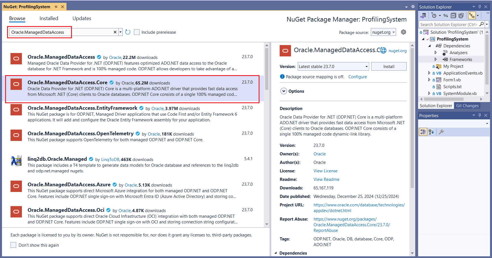
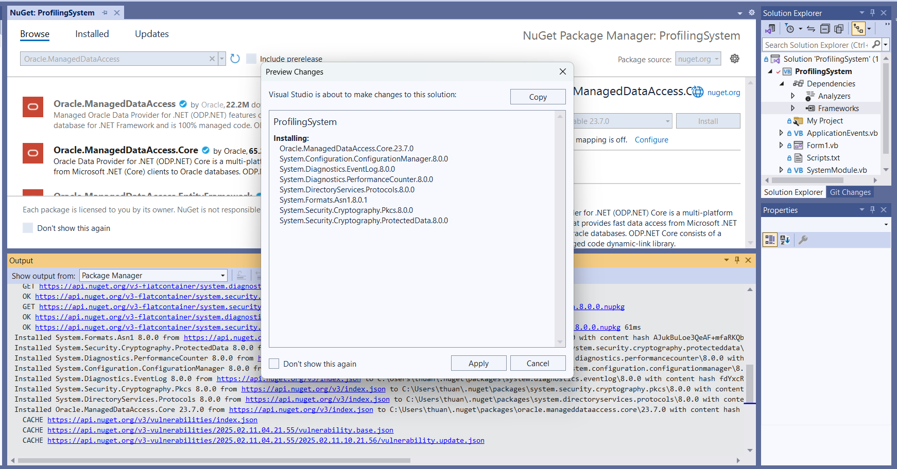

# Basic CRUD Operation in Profiling System in VB.NET with Source Code
* Original Article: https://www.sourcecodester.com/visual-basic-net/13436/basic-crud-operation-profiling-system.html

This article demo CRUD for Studen Profile information based on VB.NET and SQL Server database.
We will base on this and make the changes for using Oracle Database

# Prepare StudentInfo table on Oracle database

We already have the script file `Scripts.txt` to create table StudentInfo on MS SQL Server database
```sql
CREATE TABLE [dbo].[StudentInfo] (
    [Id]            INT            NOT NULL IDENTITY,
    [LastName]      NVARCHAR (20)  NULL,
    [FirstName]     NVARCHAR (20)  NULL,
    [MiddleName]    NVARCHAR (20)  NULL,
    [Gender]        NVARCHAR (7)   NULL,
    [Birthday]      DATETIME       NULL,
    [ContactNumber] NVARCHAR (11)  NULL,
    [Address]       NVARCHAR (200) NULL,
    [Course]        NVARCHAR (100) NULL,
    [Year]          NVARCHAR (50)  NULL,
    [Section]       NVARCHAR (50)  NULL,
    [SchoolAddress] NVARCHAR (200) NULL,
    [Created]       DATETIME       NULL,
    PRIMARY KEY CLUSTERED ([Id] ASC)
);
```

We will use the [`SQLines.com`](https://www.sqlines.com/online) tool for coverting script from SQL Server to Oracle
```sql
CREATE TABLE StudentInfo (
    Id            NUMBER(10)            NOT NULL,
    LastName      NVARCHAR2 (20)  NULL,
    FirstName     NVARCHAR2 (20)  NULL,
    MiddleName    NVARCHAR2 (20)  NULL,
    Gender        NVARCHAR2 (7)   NULL,
    Birthday      TIMESTAMP(3)       NULL,
    ContactNumber NVARCHAR2 (11)  NULL,
    Address       NVARCHAR2 (200) NULL,
    Course        NVARCHAR2 (100) NULL,
    Year          NVARCHAR2 (50)  NULL,
    Section       NVARCHAR2 (50)  NULL,
    SchoolAddress NVARCHAR2 (200) NULL,
    Created       TIMESTAMP(3)       NULL,
    PRIMARY KEY (Id)
);

-- Generate ID using sequence and trigger
CREATE SEQUENCE StudentInfo_seq START WITH 1 INCREMENT BY 1;

CREATE OR REPLACE TRIGGER StudentInfo_seq_tr
 BEFORE INSERT ON StudentInfo FOR EACH ROW
 WHEN (NEW.Id IS NULL)
BEGIN
 SELECT StudentInfo_seq.NEXTVAL INTO :NEW.Id FROM DUAL;
END;
/
```

# Installing Oracle Data Provider for .NET

Oracle Data Provider for .NET (ODP.NET) : A library for connecting Oracle databases to .NET applications.

ODP.NET can be installed using the NuGet Package Manager. Follow the steps below to install it:
* Open your project in Visual Studio.
* Right-click on the project in Solution Explorer and select Manage NuGet Packages.
* In the Browse tab, search for "Oracle.ManagedDataAccess" and install it.
    - Oracle.ManagedDataAccess: For .NET Framework
    - Oracle.ManagedDataAccess.Core: For .NET 
* This project is using .NET 8.0 LTS, then need install `Oracle.ManagedDataAccess.Core` package





```
Installing NuGet package Oracle.ManagedDataAccess.Core 23.7.0.
Writing assets file to disk. Path: C:\Develop\VB.NET\vb.net-tutorials\VB.NET-ORACLE-Profiling\ProfilingSystem\obj\project.assets.json
Successfully installed 'Oracle.ManagedDataAccess.Core 23.7.0' to ProfilingSystem
Successfully installed 'System.Configuration.ConfigurationManager 8.0.0' to ProfilingSystem
Successfully installed 'System.Diagnostics.EventLog 8.0.0' to ProfilingSystem
Successfully installed 'System.Diagnostics.PerformanceCounter 8.0.0' to ProfilingSystem
Successfully installed 'System.DirectoryServices.Protocols 8.0.0' to ProfilingSystem
Successfully installed 'System.Formats.Asn1 8.0.1' to ProfilingSystem
Successfully installed 'System.Security.Cryptography.Pkcs 8.0.0' to ProfilingSystem
Successfully installed 'System.Security.Cryptography.ProtectedData 8.0.0' to ProfilingSystem
```


# Configuring the Connection String

To connect to an Oracle database, you must properly construct a connection string, which includes the database host name, port number, service name, username, and password.
```vb
Dim connectionString As String = "User Id=username;Password=password;Data Source=(DESCRIPTION=(ADDRESS_LIST=(ADDRESS=(PROTOCOL=TCP)(HOST=hostname)(PORT=1521)))(CONNECT_DATA=(SERVICE_NAME=servicename)));"
```

In this example, replace username, password, hostname, and with your actual database information.servicename

The following code shows the basics of connecting to an Oracle database and opening a connection.

```vb
Imports Oracle.ManagedDataAccess.Client

Module Module1
    Sub Main()
        Dim connectionString As String = "User Id=USERDB;Password=PASSWORD;Data Source=(DESCRIPTION=(ADDRESS_LIST=(ADDRESS=(PROTOCOL=TCP)(HOST=localhost)(PORT=1521)))(CONNECT_DATA=(SERVICE_NAME=XEPDB1)));"
        Using connection As New OracleConnection(connectionString)
            Try
                connection.Open()
                Console.WriteLine("Connection successful! ")
            Catch ex As Exception
                Console.WriteLine("Connection Error: " & ex.Message)
            End Try
        End Using
    End Sub
End Module
```