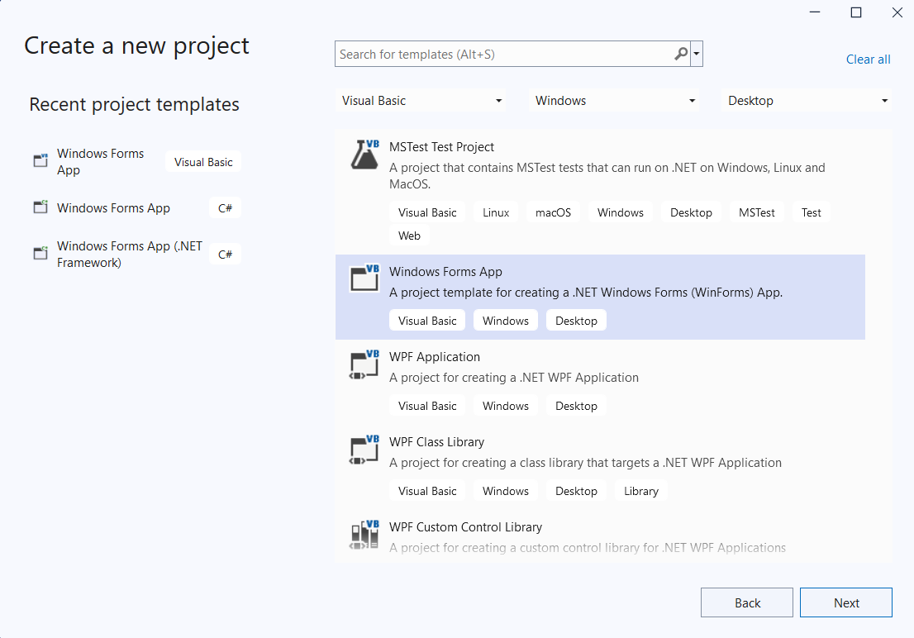
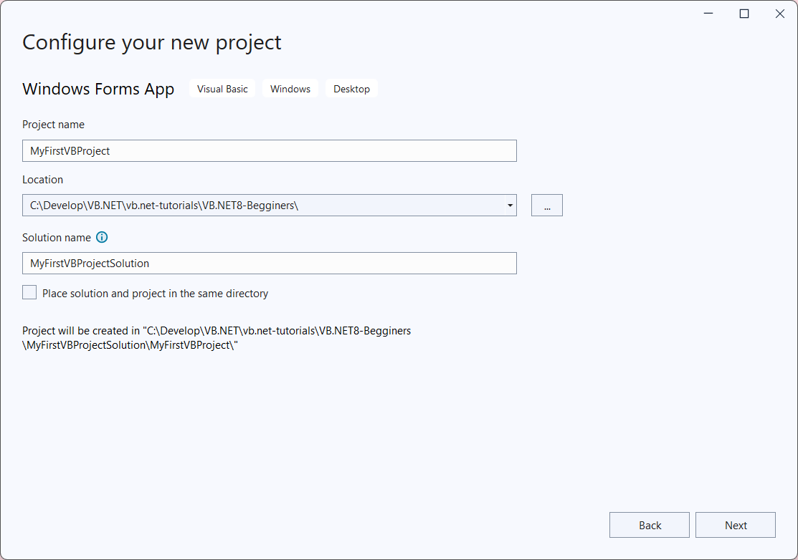
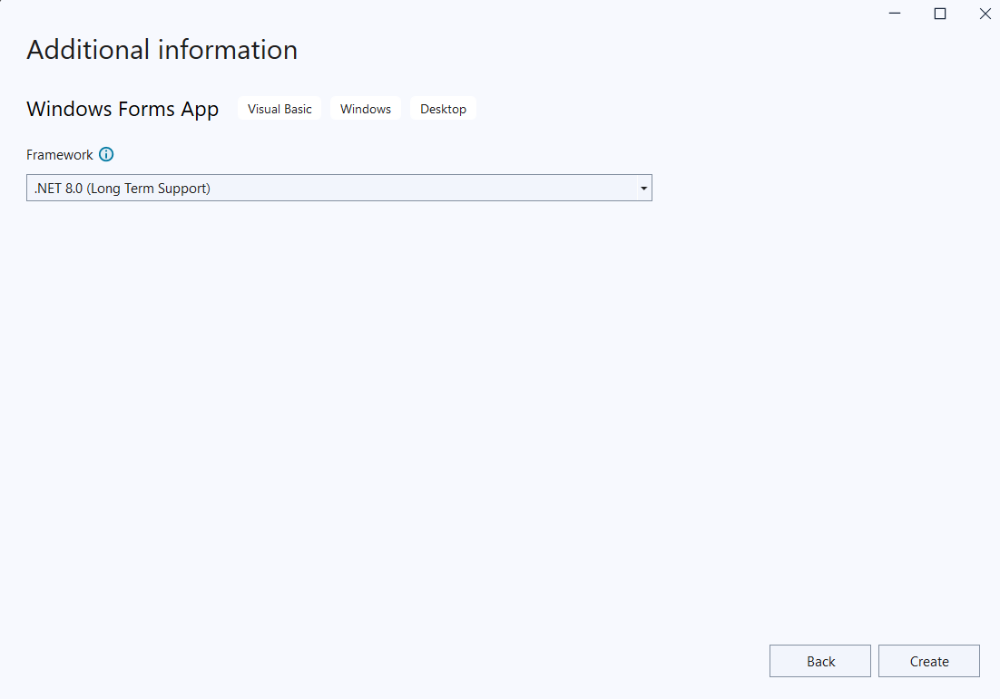
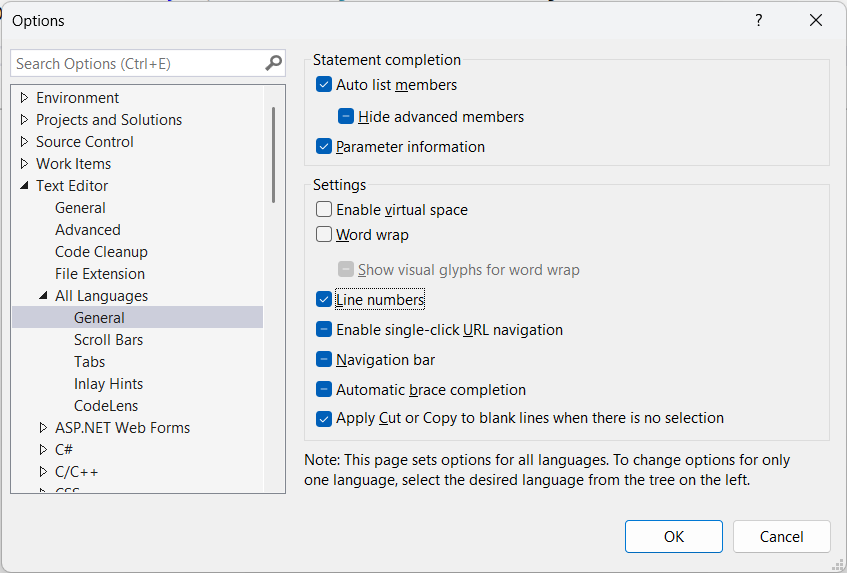
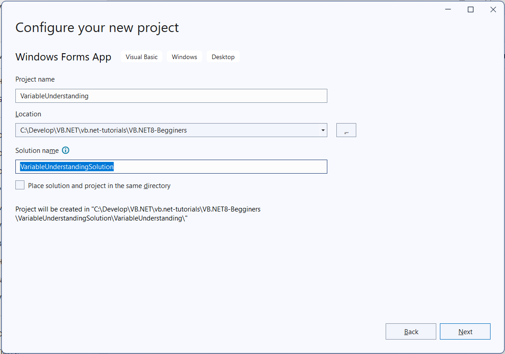
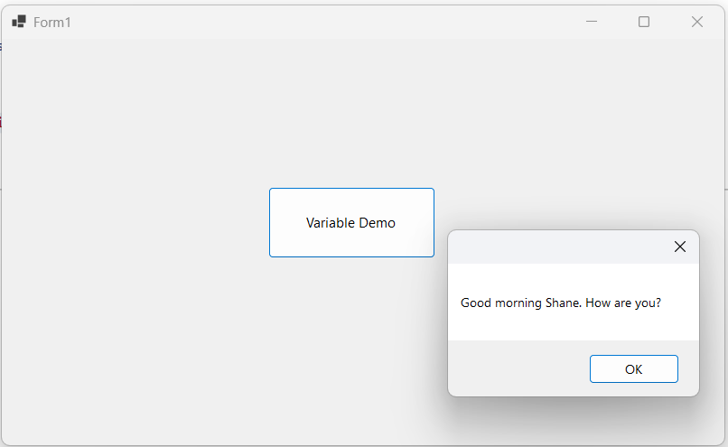

# VB.NET – Full Course for Beginners
* https://youtu.be/7Y4PD8I83g0?si=JUZDOtbjEKhbseQl

# Lesson 1: Create First project with Visual Studio

Search For templates...:
* Open Visual Studio -> Get Started with The last item "Create a new project"
* The first combo box "All languages" -> select "Visual Basic"
* The second combo box "All platforms" -> select "Windows"
* The third combo box "All project types" -> select "Desktop"
* Choose the template "Windows Forms App" ("Visual Basic" + "Windows" + "Desktop")



Configure your new project:
* Project name: MyFirstVBProject
* Location: C:\Develop\VB.NET\vb.net-tutorials\VB.NET8-Begginers\
* Solution name: MyFirstVBProjectSolution
    The project will be created at : C:\Develop\VB.NET\vb.net-tutorials\VB.NET8-Begginers\\MyFirstVBProjectSolution\MyFirstVBProject




Choosing Target Framework: 
* .Net 8.0 (Long Term Support)



Click on the Create button, the VS will create the project for you.

The folder "My Project" is required for the execution of the project


# Lesson 2: Show the Message when click a button
* Drag a button on the form
    * Text = Click Me
    * Name = btn_ShowMsg
* Double click on the buton it will generate the click event code
    * Click event = btn_ShowMsg_Click
    * Print the message: "hello world"


# Lesson 3: Learn useful tools and options in Visual Studio

* Goto Menu Tools -> Options
* Change the VS Theme: Environment -> General -> Color Theme: Blue
* Change the VS Font Color: Environment -> General -> Fonts and Colors: Cascadia Mono
    Click on UseDefaults button to reset to the default settings
* Change line numbers on the code editor: Text Editor -> All languages -> Tick on Line Numbers



* Change the default project locations: Projects and Solutions -> Locations
    * Current Location: C:\Users\thuan\source\repos
    * You can change this to the new default location for containing new projects

* Show/Hide the Tool Box: Goto Menu View -> Toolbox
* Right click on the controls to show the Properties


# Lesson 4: Variable in Visual Basic

Create new project:
* Project name: VariableUnderstanding
* Solution name: VariableUnderstandingSolution



To declare a variable using keyword `Dim` (stands for Dimension). Dimension means we are saying in the memory you should hold this variable temporarily with certain data. Visual Basic is going to take care of that entirely you don't have to worry how the memory functions behind the scene. All you need to now `Dim` is the keyword to declare a variable with the specific type example String.
```vb
Dim FirstName As String
```

Next, we are going to assign some value to this variable:
```vb
FirstName = "Shane"
```

Now we will use this value to show the message:
```vb
MessageBox.Show("Good morning " & FirstName & ". How are you?")
```




# Lesson 5: Data Types

We have the properties of iPhone with different data types:
    * Brand = Apple (String)
    * Model = iPhone 16 (String)
    * Battery = 4500 (Integer)
    * ScreenSize = 6.7 (Double)
    * Price = $799.99 (Decimal)
    * Availability = True (Boolean)

Use the ampersands symbol (`_`) before the variable to break line of it is too long
```vb
Dim StrBrand As String
Dim StrModel As String
Dim IntBattery As Integer
Dim DoubScreenSize As Double    '15->16 Digits
Dim DecPrice As Decimal         '28->29 Digits Higher Precision
Dim BoolAvailability As Boolean

StrBrand = "Apple"
StrModel = "iPhone 16"
IntBattery = 4500
DoubScreenSize = 6.7
DecPrice = 799.99
BoolAvailability = True

MessageBox.Show(StrBrand & " " & StrModel & " " & IntBattery & " " & _
                DoubScreenSize & " " & DecPrice & " " & BoolAvailability)
```


# Lesson 6: Input Box

We are going to create a form to get input data for First Name, Last Name, Email

